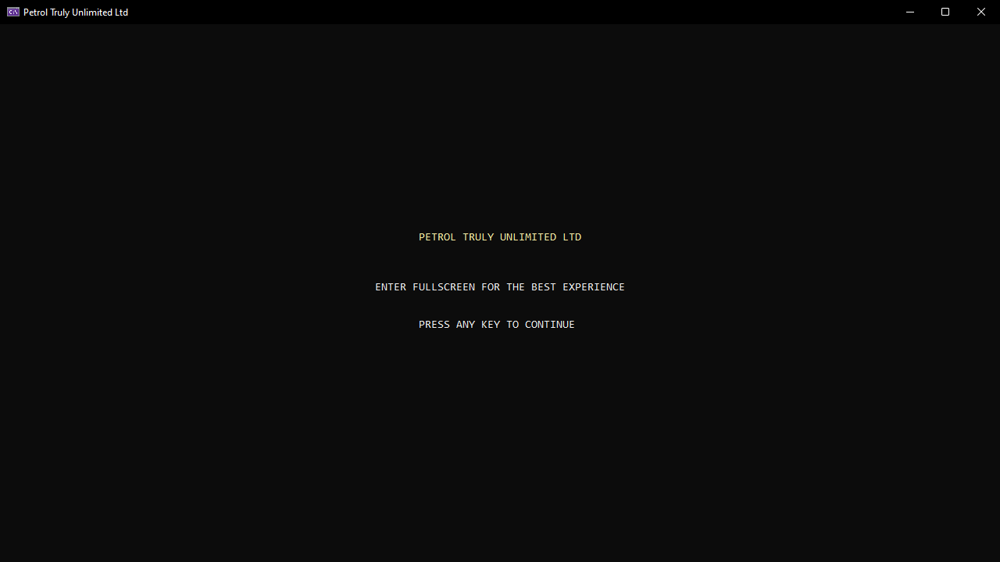

<h1>
  Petrol Station Management Simulator
</h1>

This is part of the coursework for the C# Programming course in the first year of my Computer Science degree. The goal was to learn fundamental programming ideas and the basics of the C# language.

The petrol station consists of a dynamic forecourt of fuel pumps split into lanes where vehicles can fill up their tanks. If fuel pumps are busy or a lane is blocked by a preceding busy fuel pump, then vehicles can queue and wait until a pump or lane frees up. There are several factors the simulation takes into account:

- <a href="https://github.com/omosborne/petrol-station-management/blob/main/Assignment2_1602819/Station.cs#L33">Number of pumps</a>
- <a href="https://github.com/omosborne/petrol-station-management/blob/main/Assignment2_1602819/Station.cs#L34">Number of lanes</a>
- <a href="https://github.com/omosborne/petrol-station-management/blob/main/Assignment2_1602819/Station.cs#L38-L40">Fuel costs</a>
- <a href="https://github.com/omosborne/petrol-station-management/blob/main/Assignment2_1602819/Station.cs#L37">Attendant commission</a>
- <a href="https://github.com/omosborne/petrol-station-management/blob/main/Assignment2_1602819/Station.cs#L32">Maximum queue size</a>
- <a href="https://github.com/omosborne/petrol-station-management/blob/main/Assignment2_1602819/Vehicle.cs#L87">Vehicle types</a>
  - Car
  - Van
  - HGV (Heavy Goods Vehicle)
- <a href="https://github.com/omosborne/petrol-station-management/blob/main/Assignment2_1602819/Fuel.cs#L9">Fuel types</a>
  - Unleaded
  - Diesel
  - LPG (Liquefied Petroleum Gas)

 

Different vehicles take different lengths of time to fill up their tanks, starting with the quickest for cars and the longest for HGVs. Along with this, each type of vehicle can only operate with specific types of fuel; these are as follows:

 

<table align="center">
  <tr>
    <th>Vehicle</td>
    <th>Unleaded</td>
    <th>LPG</td>
    <th>Diesel</td>
  </tr>
  <tr>
    <td>Car</td>
    <td>✅</td>
    <td>✅</td>
    <td>✅</td>
  </tr>
  <tr>
    <td>Van</td>
    <td>❌</td>
    <td>✅</td>
    <td>✅</td>
  </tr>
  <tr>
    <td>HGV</td>
    <td>❌</td>
    <td>❌</td>
    <td>✅</td>
  </tr>
</table>

 

Below are the visualised fields to indicate the length of time a fuelling session has taken. Starting from the left, a vehicle has just started fuelling up. Moving through the stages to the right until the last one, which indicates the vehicle is about to finish. Once the vehicle finishes, it will leave the pump.

 

<table align="center">
  <tr>
    <td></td>
    <td></td>
    <td></td>
    <td></td>
    <td></td>
  </tr>
</table>

 

<h2>
  Demo Screenshots
</h2>

In the screenshots below, the program can be seen operating the petrol station simulation by displaying the queue area, the forecourt of pumps, and various counters to track the data passing through the program. Throughout the use of the program, the customer's transaction is recorded in the counter area at the pump they used, however, these details are also stored in a .csv (comma-separated values) file that can be easier to analyse and manipulate for graphs if needed. An example of this file can be seen in the last demo screenshot below.

  
   
  
   
  
   
  
   
  
   
  

 

<h2>
  Lane Blockages
</h2>

Depending on the number of pumps and lanes used in the program, certain pumps might be blocked from use by a preceding pump being used. This means that vehicles will fill up pumps furthest to the right first and then as they become busy the ones to the left start filling up. If all pumps are busy and the ones to the right finish first, new vehicles will need to queue and wait until the blocking pump is cleared before they can start to enter the forecourt.

  
   
  
   
  
   
  

In the above screenshots, 9 pumps split into 3 lanes have been used and show several different scenarios to visualise how the lane blocking functionality works. Green arrows and red crosses have been added extra into these images to aid in visualisation. A green arrow means the part of the lane between the two pumps is free, and a red cross means it's blocked by the preceding pump.
